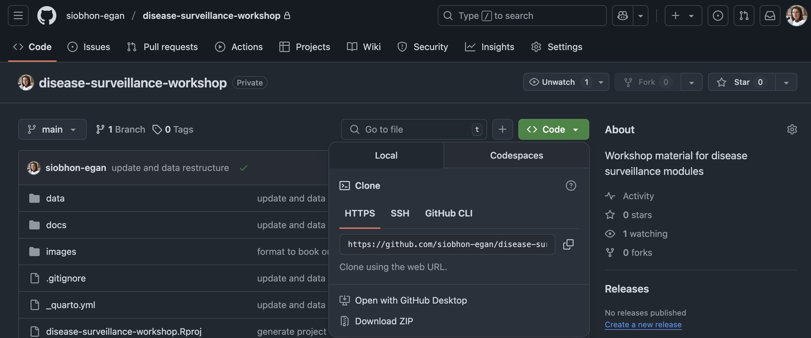
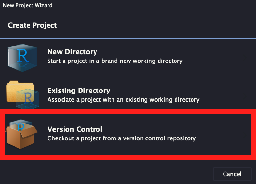
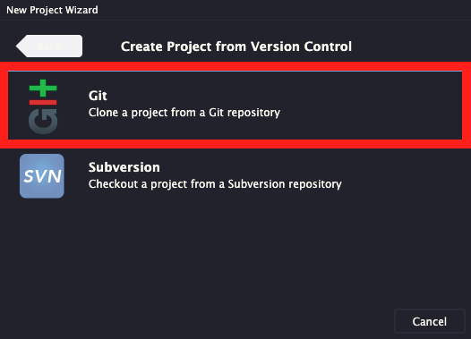
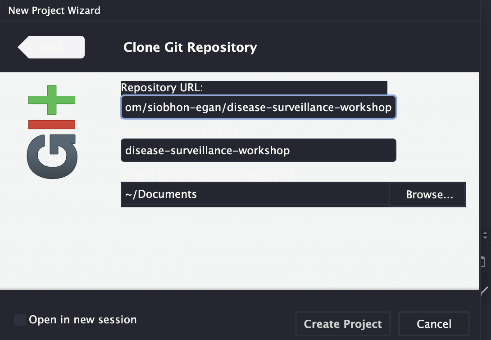

# Data in Disease Surveillance Workshop

To follow along with the workshops the easiest way to download all the code and data is via the github repository available at https://github.com/siobhon-egan/disease-surveillance-workshop. Below are some options on how to download.

View the content online at the [website](https://siobhonlegan.com/disease-surveillance-workshop)

## Options for download

### 1. Download repository from GitHub

https://github.com/siobhon-egan/disease-surveillance-workshop

Click on the green `code` button and click `Download ZIP`. Unzip file on your computer.

If you click on [this link](https://github.com/siobhon-egan/disease-surveillance-workshop/archive/refs/heads/master.zip) a download will automatically start. Unzip the folder and begin.



### 2. From RStudio

Open RStudio and select **File** \> **New Project**



Select the third option for **Version Control**



Paste in the URL `https://github.com/siobhon-egan/disease-surveillance-workshop`, select where you want to Save the project and then **Create Project**

{width="526" height="376"}

## How to use

### Reproducing the lesson material

If you want to follow along an execute the commands to reproduce on your local computer the easiest way it to open the `disease-surveillance-workshop.Rproj` file and it will open a new session in RStudio. Simply open the lesson file e.g. `data-introduction.qmd` and you can execute the commands. What you are viewing is essentially the back-end of the website.

I recommend having both RStudio open with the code file and a web brower to view the material via the [webiste](https://siobhonlegan.com/disease-surveillance-workshop)

### Data

Assuming you have downloaded the entire repository all the relevant data is stored in the **data/** directory.

::: callout-note
To allow non-R users to follow along some datasets are also saved as a `.csv` file for you to open in excel.
:::

### Packages for R

You will need to install the package pacman the first time run you run this. You can do this by executing the chunk below. Using `p_load` command from the `pacman` package makes it easier to load/install libraries.

```{r}
#| eval: false
#| include: false
install.packages("pacman")
```

Then at the start of each lesson is a function to install/load packages using the `p_load()` command (explained below).

::: {.callout-note appearance="simple" collapse="true"}
#### The `p_load()` function

A handy way to load packages the function checks if the package is installed, if not it attempts to install the package from CRAN and/or any other repository in the pacman repository list.
:::

### R version

This workshop was built using `R version 4.3.1 (2023-06-16)` and RStudio `2024.12.1+563 (2024.12.1+563)`.
